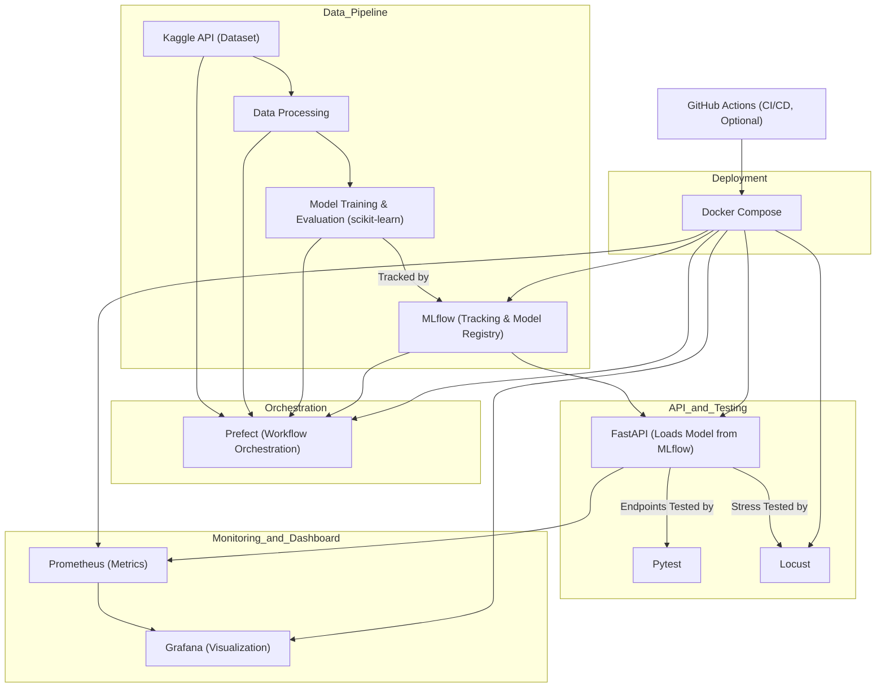

# News Classification MLOps

[](https://www.python.org/downloads/)
[](https://opensource.org/licenses/MIT)
[](https://mlops.org)

An end-to-end MLOps pipeline for training, deploying, and monitoring a news classification model using BBC articles dataset from Kaggle. This project demonstrates best practices in MLOps including model training, deployment, monitoring, and CI/CD.

## 🚀 Features

- **FastAPI Service**: Async API with multi-worker support and API key authentication
- **ML Pipeline**: Automated data processing, training, and evaluation using Prefect
- **Model Management**: Experiment tracking and model versioning with MLflow
- **Monitoring**: Real-time metrics and dashboards with Prometheus & Grafana
- **Testing**: Unit tests, integration tests, and load testing with Locust
- **Containerization**: Docker support for easy deployment
- **CI/CD**: Automated testing and deployment with GitHub Actions

## 📋 Prerequisites

- Docker and Docker Compose

## 🏗️ Project Structure

```
.
├── src/
│   ├── data/         # Data download and preprocessing
│   ├── models/       # Model training and evaluation
│   ├── api/          # FastAPI service implementation
│   └── pipelines/    # Prefect workflow definitions
├── tests/            # Unit and integration tests
├── notebooks/        # Jupyter notebooks for exploration
├── configs/          # Configuration files
└── workflows/        # CI/CD workflow definitions
```

## 🚀 Getting Started

### 1. Clone and Setup

```bash
# Clone the repository
git clone https://github.com/kingabzpro/A-to-Z-MLOps.git
cd A-to-Z-MLOps
```

### 2. Environment Configuration

1. Copy the example environment file:
   ```bash
   cp .env.example .env
   ```

2. Update `.env` with your configuration:
   ```env
   API_KEY=your_api_key
   CACHE_TTL=3600
   KAGGLE_USERNAME=your_kaggle_username
   KAGGLE_KEY=your_kaggle_api_key
   ```

> ⚠️ **Security Note**: Never commit your `.env` file to version control.


### 3. Docker Compose

```bash
# Start all services
docker-compose up -d
```

Available services:
- FastAPI: [http://localhost:7860/docs](http://localhost:7860/docs)
- Prometheus: [http://localhost:9090](http://localhost:9090)
- Grafana: [http://localhost:3000](http://localhost:3000) (admin/admin)
- MLflow: [http://localhost:5000](http://localhost:5000)
- Prefect: [http://localhost:4200](http://localhost:4200)
- Locust: [http://localhost:8089](http://localhost:8089)


```bash
# Stop all services
docker-compose down
```


## 🔧 Troubleshooting

1. **API Connection Issues**
   - Verify API key is correctly set in `.env`
   - Check if the service is running on the correct port
   - Ensure all required environment variables are set

2. **Docker Issues**
   - Ensure Docker daemon is running
   - Check port conflicts
   - Verify Docker Compose version compatibility

## 🛠️ Tech Stack

- **Package Management**: uv
- **Data Source**: Kaggle
- **Machine Learning**: scikit-learn
- **Model Management**: MLflow
- **Workflow Orchestration**: Prefect
- **API Framework**: FastAPI
- **Load Testing**: Locust
- **Monitoring**: Prometheus & Grafana
- **Containerization**: Docker & Docker Compose
- **CI/CD**: GitHub Actions

## 📝 Stats and Dashboards


### Project Strcuture
This project leverages a robust MLOps pipeline, integrating data ingestion, model training, evaluation, deployment, monitoring, and testing. The workflow is as follows:



### Prefect
Prefect orchestrates the workflow, running all steps in sequence and generating detailed logs for each stage.


### MLFlow

MLflow tracks all model training metrics and manages the model registry.


The trained model is registered in the MLflow Model Registry and loaded by the FastAPI application.


### Machine Learning Application
The FastAPI application exposes three endpoints: `/info`, `/predict`, and `/metrics`.


### Locust
Locust is used for stress testing the API, providing detailed statistics and real-time graphs of request performance.

Stress test graph to observe what happens at each second.


### Prometheus
Prometheus collects and displays system and application metrics, enabling real-time monitoring.


### Grafana
Grafana dashboards provide a comprehensive overview of the deployed model's performance and system health.


### Docker
Docker Desktop shows all running services and their respective ports, simplifying service management.
