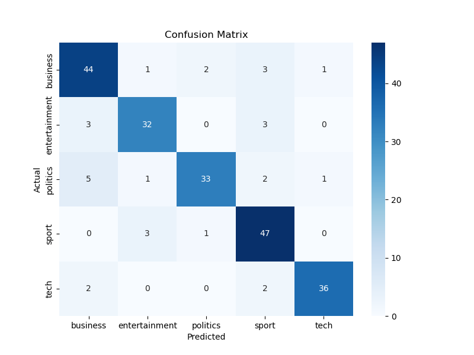
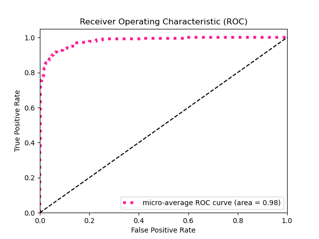

# Model Evaluation Report

## Overall Metrics

- **Accuracy:** 0.8649
- **F1 Score (weighted):** 0.8650
- **Precision (weighted):** 0.8688
- **Recall (weighted):** 0.8649
- **Log Loss:** 0.4852
- **ROC AUC:** 0.9811

## Per-class Metrics

```
               precision    recall  f1-score   support

     business       0.81      0.86      0.84        51
entertainment       0.86      0.84      0.85        38
     politics       0.92      0.79      0.85        42
        sport       0.82      0.92      0.87        51
         tech       0.95      0.90      0.92        40

     accuracy                           0.86       222
    macro avg       0.87      0.86      0.87       222
 weighted avg       0.87      0.86      0.86       222

```

## Visualizations

### Confusion Matrix


### ROC Curve


## Model Information

- **Model Name:** news_classifier_logistic
- **Model Version:** 1
- **Classes:** business, entertainment, politics, sport, tech
- **Feature Count:** 222
